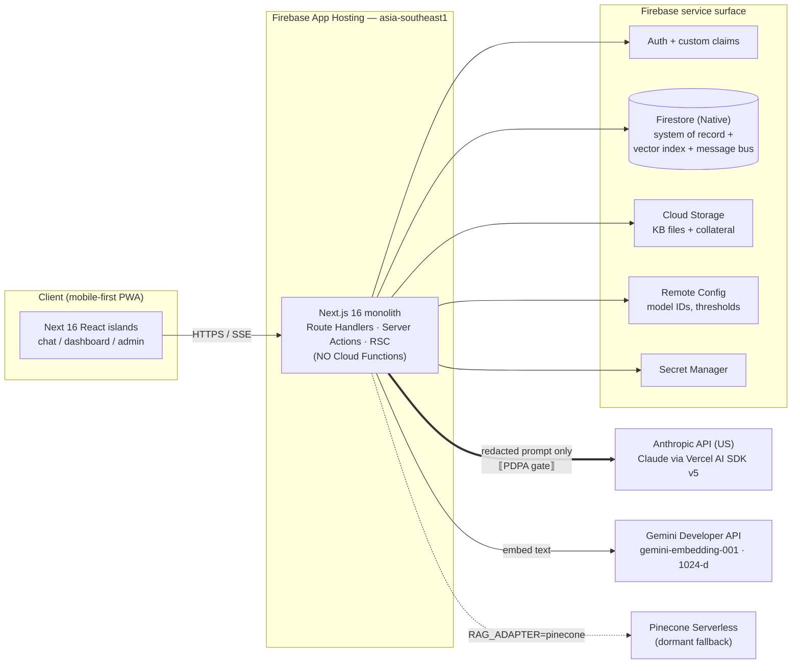
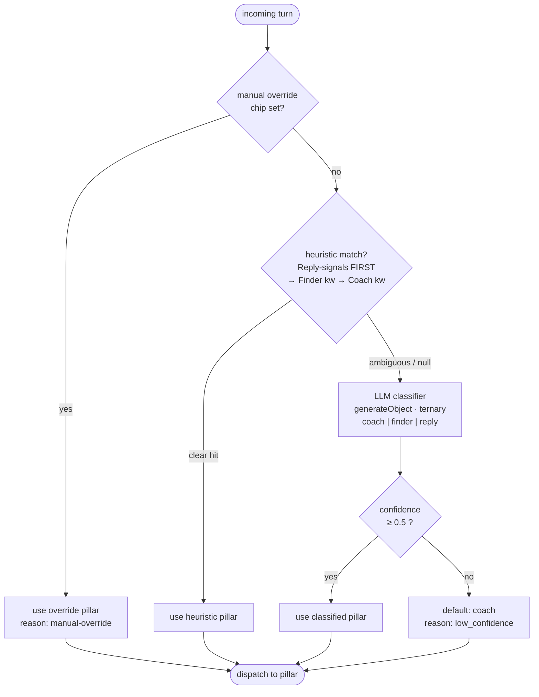
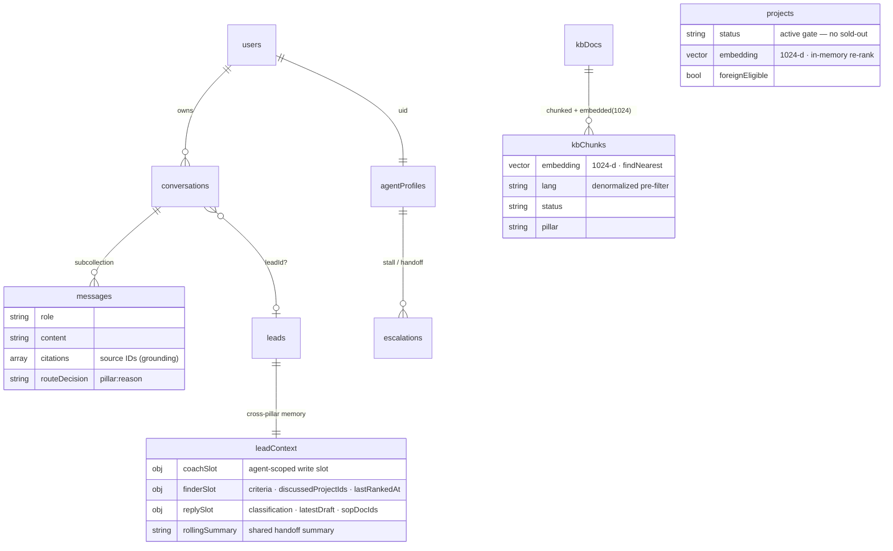
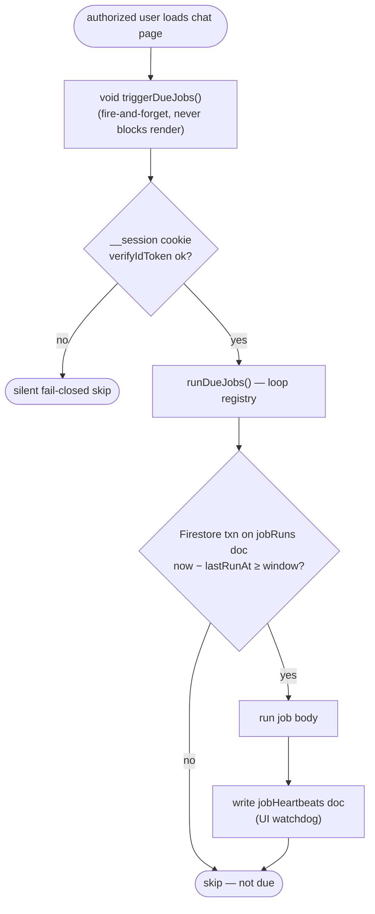

# Architecture — D2 Customer Service AI Agent Platform (`cy-csaiagent`)

> **How this platform actually works.** This is the developer-facing companion to
> [`.planning/TSD.md`](../.planning/TSD.md) (the spec-of-record). Where the TSD describes intent,
> this doc describes the **as-built** system, traced from source. Diagrams are Mermaid (render on GitHub).
>
> **Status: code-complete, pre-deploy.** STATE.md is `v1.0-code-complete-gaps-closed` — the code below
> exists and is wired; it has not yet been deployed to a live Firebase stack. Read these diagrams as
> *as-coded architecture*, not *live-running infrastructure*.

---

## TL;DR

A **single Next.js 16 monolith on Firebase App Hosting**. Firestore is simultaneously the system of
record, the vector index, and the cross-agent message bus — no event bus, no microservices, **no Cloud
Functions, no external scheduler**. One mobile-first chat surface routes between three specialist AI
pillars (Onboarding **Coach**, Property **Finder**, Reply **Assistant**), plus a senior-coach dashboard
and an admin KB app. The chat SSE route handler (`app/api/chat/route.ts`) is the integration spine:
every request passes five gates — **auth → rate-limit → PDPA redaction → intent routing → model stream** —
before any token is spent.

Hard constraints (enforced, not aspirational): model IDs come from Remote Config (never hard-coded);
PII is pseudonymized at the Claude boundary; Reply never auto-sends; periodic work runs as an on-visit
lazy-cron Server Action; `src/` core never imports from `app/` shell.

---

## 1. System context — boundaries and trust

The browser talks to one Next app. The app fans out to Anthropic (the LLM), Gemini (embeddings, via the
**Developer API** — not Vertex), and the Firebase service surface. The **PDPA pseudonymization gate** sits
on the edge to Anthropic: no un-redacted PII crosses the US boundary.



- **One deployable unit.** All server logic is Next.js Route Handlers / Server Actions / Server Components.
  There is no `functions/` directory (verified by grep).
- **Firestore is three things at once:** documents (system of record), a KNN vector index (`findNearest`),
  and the cross-pillar message/handoff bus. No separate vector DB by default — Pinecone is a coded-but-dormant
  adapter behind `RAG_ADAPTER=pinecone` (`src/rag/index.ts`).
- **The PDPA boundary is the Anthropic edge.** Names, phones, IC, email, and RM-financial figures are
  tokenized before the prompt leaves the app (`src/audit/pdpa.ts`); an `assertRedacted()` gate throws 422
  rather than send raw PII.
- **Region `asia-southeast1` is immovable** — confirm with Derek before creating any resource.

---

## 2. The chat request — five gates, then stream

`app/api/chat/route.ts` `POST` is the spine. The order is deliberate: **nothing reaches the model until
gates 1–4 pass**, so abuse and PII never cost tokens. Side effects (persistence, audit, usage) run *after*
the stream, in `onFinish` and Next's `after()`, so they never delay first-token latency.

```mermaid
sequenceDiagram
    autonumber
    participant C as Client island<br/>(chat-input.tsx)
    participant PX as proxy.ts<br/>(locale only)
    participant R as /api/chat (Node)
    participant RL as ratelimit
    participant PD as pdpa
    participant RT as router
    participant AG as agent (pillar)
    participant RAG as rag.retrieve
    participant LLM as llm → Anthropic
    participant FS as Firestore

    C->>PX: POST /api/chat (Bearer token, body)
    Note over PX: API routes excluded from locale matcher
    PX->>R: forward
    R->>R: GATE 1 — requireUser(req) → uid  (401)
    R->>RL: GATE 2 — check(uid,'chat')  (429)
    R->>R: parse body + per-message detectLang
    R->>FS: ensurePrimaryThread(uid, lang) → cid
    R->>PD: GATE 3 — pseudonymize + assertRedacted  (422)
    R->>RT: GATE 4 — routeAsync(msgs, override) → {pillar, reason}
    Note over R: Reply fail-closed: 400 if reply && no leadId
    R->>AG: build system prompt + tools; read stored slot
    AG->>RAG: retrieve (lang-filtered findNearest)
    RAG-->>AG: grounded chunks + source IDs
    R->>LLM: GATE 5 — streamText() (model from Remote Config)
    LLM-->>C: SSE tokens (toUIMessageStreamResponse)

    Note over R,FS: onFinish (after stream)
    R->>FS: appendMessage (user + assistant, w/ citations + routeDecision)
    R->>FS: writeLeadSlot (finder/reply slot, never inside a tool)
    R->>RL: decrement(uid, tokens)
    Note over R,FS: after() — fire-and-forget
    R->>FS: audit.log (hashes only) · usage.recordUsageEvent (counts only)
```

Key facts (all in `app/api/chat/route.ts`):

- **Gate 1 — Auth.** Claims are read from the *verified* token, never the request body.
- **Gate 2 — Rate limit.** Per-agent budget checked before any spend; 429 when over.
- **Gate 3 — PDPA.** Lead-name lookup → `pseudonymize()` → `assertRedacted()`. Runs for **all** pillars.
- **Gate 4 — Route.** `routeAsync` returns `{pillar, reason}`; `routeDecision = pillar:reason` is persisted
  on every message and audit row (see §3).
- **Gate 5 — Stream.** `streamText()` is the only model call. `stopWhen` allows a 5-step tool loop for
  Finder/Reply, single-step for Coach. Output is `result.toUIMessageStreamResponse()` (the AI SDK v5 method —
  the TSD's `toDataStreamResponse()` does not exist in `ai@5.0.193`), with `Cache-Control: no-store` and
  `X-Accel-Buffering: no`.
- **Grounding is mandatory.** Coach answers carry KB citation IDs; Finder enforces `status:'active'` projects;
  Reply emits `no_sop_match` (→ records a knowledge gap) rather than inventing SOP content.
- **Structured-output cards.** Reply and Finder emit JSON in the final text; the client decodes it into
  `ReplyDraftCard` / `MatchList` (`app/[lang]/chat/decode-structured-output.ts`). Coach renders plain text.

---

## 3. Intent routing — heuristic-first, classifier-backed

`src/router/routeAsync` decides which pillar handles a turn, in three tiers. **The LLM classifier is live**
(not a future seam — the TSD framed it as Phase 3; it's done). Most turns resolve on the cheap heuristic tier;
only ambiguous ones pay for a classifier call.



- **Reply structural signals are checked first** (`src/router/heuristic.ts`) so a pasted inbound message
  mentioning "RM" / "financing" routes to Reply, not Finder.
- **Classifier model is Remote-Config-resolved** (`modelFor('router')`, fallback `claude-haiku-4-5`).
- Below `ROUTER_CONFIDENCE_THRESHOLD = 0.5`, routing defaults to **Coach** with a `low_confidence:…` reason.
- The synchronous `route()` is kept only for non-awaiting callers (e.g. the stall-detect job); the chat
  route always uses async `routeAsync`.

---

## 4. Core/shell split — the portability contract

The codebase is split so the **application core is unit-testable without Next.js**. `app/` (the shell) imports
from `src/` (the core) freely; `src/` **never** imports from `app/` or `next` (enforced by a banner in each
core file). This is what lets the same agents/router/rag logic run under Vitest with a fake LLM provider.

```mermaid
flowchart LR
    subgraph shell["app/ — Next 16 shell"]
        direction TB
        PROXY["proxy.ts<br/>locale routing (optimistic, NOT auth)"]
        SEG["app/[lang]/<br/>(chat)(coach)(admin)(auth)"]
        API["app/api/<br/>chat · kb/ingest · auth/session"]
        ACT["app/_actions/<br/>chat.ts · jobs.ts (lazy-cron trigger)"]
    end

    subgraph core["src/ — portable core (no app/ or next import)"]
        direction TB
        AGENTS["agents/<br/>coach · finder · reply<br/>(read-only tools)"]
        ROUTER["router/<br/>heuristic + LLM classifier"]
        LLM["llm/<br/>modelFor() over AI SDK v5 (+ fake)"]
        RAG["rag/<br/>retrieve facade · embed · pinecone"]
        MEM["memory/<br/>conversation · leadContext slots"]
        KB["kb/ + inventory/<br/>doc CRUD · ingest · project search"]
        GOV["audit · pdpa · ratelimit · escalation · usage"]
        JOBS["jobs/<br/>runDueJobs · heartbeat"]
        FB["firebase/<br/>admin · collections (single source) · auth"]
        I18N["i18n/<br/>routing · detectLang"]
    end

    shell -->|"imports — one direction only"| core
    core -.->|NEVER imports| shell
```



Two naming traps worth knowing:

- **`src/agents/coach`** (the Coach *agent*) vs **`src/coach/journey`** (the onboarding *state machine*).
- **`src/agents/reply`** (the Reply *agent*) vs **`src/reply`** (the reply-edit *diff* utility for the
  edit-as-signal store).

Agent tools are **read-only** and authenticate **as the user** — never as admin from a user-facing path.

---

## 5. Data model — Firestore as system of record + bus

`src/firebase/collections.ts` is the single source of truth: a typed ref + converter per collection. The
converter stamps **`tenantId: 'd2'`** on every write (single-tenant today, multi-tenant-ready). There are
**20 typed collections + 2 operational docs** (`jobRuns`, `jobHeartbeats`) — the TSD's "14" is stale. Messages
live in a **subcollection** (`conversations/{cid}/messages`), never an inline array (1 MB doc-size trap).



The remaining collections (not all drawn above): `collateral`, `kbIngestionJobs`, `auditLogs` (append-only,
hashes only), `evals`, `rateBudgets`, `knowledgeGaps`, `replyEdits`, `usageEvents`, `usageRollups`,
`erasureRequests`, plus operational `jobRuns` / `jobHeartbeats`.

### Cross-pillar memory (`leadContext/{leadId}`)

This one shared doc is the **handoff medium** between Coach, Finder, and Reply. It holds three
**agent-scoped write slots** plus a shared `rollingSummary`. `writeLeadSlot(leadId, slot, …)` writes *only*
the named slot — slot isolation is the security contract, so one pillar can never clobber another's state.
Slots are written in the chat route's `onFinish`, **never inside a tool**.

### Retrieval: two different engines

- **KB retrieval** (`kbChunks`) uses Firestore **`findNearest`** KNN with a lang/status/pillar pre-filter.
- **Project search** (`projects`, the Finder) uses a **deterministic filter gate + in-memory dot-product
  re-rank** — because Firestore range filters (price bands, dates) can't combine with `findNearest` in one
  query. Don't conflate the two.

---

## 6. Background jobs — on-visit lazy-cron

There is **no wall-clock scheduler**. When an authorized user loads the chat page, an RSC fires
`triggerDueJobs()` (a Server Action) fire-and-forget. Each job is gated by a per-window Firestore
transaction on `jobRuns/{jobName}`, so concurrent visitors run each job **exactly once per window**. The
tradeoff: a truly idle period defers jobs, and a UI watchdog surfaces a stale last-run.



The six registered jobs (`src/jobs/runDueJobs.ts` — the TSD named only four):

| Job | Window | What it does |
|-----|--------|--------------|
| `stall-detect` | 24h | find agents stalled ≥ 2d → escalation row + cadence-capped in-app nudge |
| `escalate` | 24h | working-hours-gated 48h escalation surfacing |
| `eval-nightly` | 24h | nightly Promptfoo eval (Opus judge) |
| `usage-rollup` | 24h | idempotent daily usage rollup |
| `erasure-sweep` | **1h** | chunked PDPA erasure delete (the only sub-daily window) |

> **Zero Cloud Functions, zero external scheduler** — verified by grep. The only references to QStash/cron
> are comments explaining what this design *replaces*.

---

## Plan vs reality — material deltas from the TSD

The TSD is the intent; the code moved on in a few places. If you read the TSD, correct for these:

| TSD says | Reality |
|----------|---------|
| 14 Firestore collections | **20 typed + 2 operational** (`src/firebase/collections.ts`) |
| LLM classifier "activates Phase 3" | **Active now** — real `generateObject` ternary classifier |
| 4 lazy-cron jobs | **6 jobs** (+ `usage-rollup`, + `erasure-sweep` @ 1h) |
| stream via `toDataStreamResponse()` | code uses `toUIMessageStreamResponse()` (AI SDK v5) |
| inventory uses `findNearest` | project search uses **in-memory dot-product**; only KB uses `findNearest` |

---

## Where to go deeper

- **The spec-of-record:** [`.planning/TSD.md`](../.planning/TSD.md) §3–§4 (component map, data-flow, 14→20 data model).
- **Project context & requirements:** [`.planning/PROJECT.md`](../.planning/PROJECT.md), [`.planning/REQUIREMENTS.md`](../.planning/REQUIREMENTS.md).
- **As-built trace with file:line citations:** [`.planning/quick/quick-kayinleong-006/quick-kayinleong-006-RESEARCH.md`](../.planning/quick/quick-kayinleong-006/quick-kayinleong-006-RESEARCH.md).
- **The integration spine in code:** `app/api/chat/route.ts` (read this first), then `src/router/`, `src/memory/leadContext.ts`, `src/jobs/runDueJobs.ts`.
